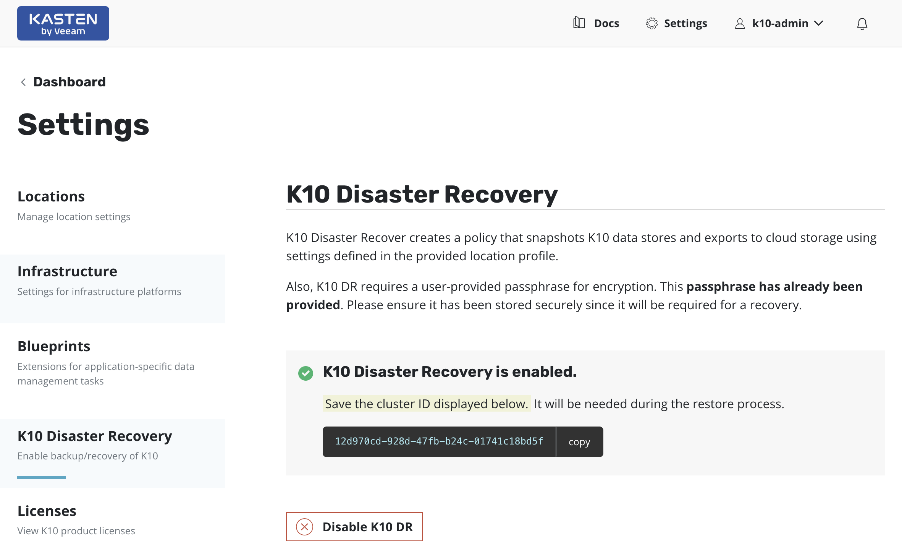

***Status:** Work-in-progress. Please create issues or pull requests if you have ideas for improvement.*

# **Kasten K10 full automated Disaster Recovery with Ansible**
Example of using the Kasten K10 Disaster Recovery feature with Ansible to automate the Disaster Recovery Plan for Kubernetes workloads.

## Summary
This projects demostrates the process of recovering a Kasten K10 instance and all the protected Kubernetes workloads (applications) after a disaster ocurrs on Kubernetes cluster.  

All the automation is done using Ansible playbooks and leveraging the [Kasten K10 API](https://docs.kasten.io/latest/api/cli.html).

## Disclaimer
This project is an example of an deployment and meant to be used for testing and learning purposes only. Do not use in production. 

# Table of Contents

1. [Getting started](#Getting-started)
2. [Prerequisites](#Prerequisites)
3. [Recovering K10 and all Kubernetes Applications From a Disaster](#Recovering-K10-and-all-Kubernetes-Applications-From-a-Disaster)
4. [Parameters](#Parameters)
5. [Recovery duration](#Recovery-duration)
6. [File structure and deployment workflow](#File-structure-and-deployment-workflow)

# Getting started

K10 Disaster Recovery (DR) aims to protect K10 from the underlying infrastructure failures. In particular, this feature provides the ability to recover the K10 platform in case of a variety of disasters such as the accidental deletion of K10, failure of underlying storage that K10 uses for its catalog, or even the accidental destruction of the Kubernetes cluster on which K10 is deployed.

K10 enables Disaster Recovery with the help of an internal policy to backup its own data stores and store these in an object storage bucket or an NFS file storage location configured using a Location Profile.

## Prerequisites

To run this project you need to have some software installed and configured: 
1. A workstation with the next tools installed:
	- Kubectl
	- Kubernetes Collection for Ansible
	- Helm
	- jq
	- (If restoring in AWS EKS) aws-cli, aws-iam-authenticator and a AWS named profile.
	- (If restoring in Azure AKS) azure cli 
	- (If restoring in Google GKE) gcloud CLI and gke-gcloud-auth-plugin for use with kubectl 
1. A working [Ansible installation](https://docs.ansible.com/ansible/latest/installation_guide/intro_installation.html).
1. A working clean Kubernetes cluster to be used to restore Kasten K10 and all applications.  In this project we will provide the process and the Ansible Playbooks to restore Kasten K10 and all kubernetes applications in **AWS EKS, Azure AKS and Google Cloud GKE**.
1. The Production Kubernetes cluster (cluster to be recovered) must have been using [Kasten K10](https://docs.kasten.io/latest/install/index.html) to backup all applications and cluster-wide resources.
	- Kasten K10 Disaster Recovery must have been enabled in the Production cluster.
	- A [Location Profile](https://docs.kasten.io/latest/usage/configuration.html) must be provided to store the Kasten configuration backups.
	- During the enabling process it's necessary to provide a passphrase for encrypting the snapshot data. The passphrase can be provided directly or provided from a HashiCorp Vault instance if K10 is configured to access Vault.   This passphrase **will be required** afterward to restore the Kasten configuration.
	- Once K10 Disaster Recovery is enabled, a  confirmation message with the cluster ID will be displayed when Disaster Recovery is enabled. Save the cluster ID safely, **it is required to recover K10 from a disaster**.
1. Kasten K10 Disaster Recovery Policy and all Policies protecting Kubernetes applications must have been run at least once to provide the required restore points for this project.

	
	
**IMPORTANT**: After enabling K10 Disaster Recovery, it is essential that you copy and save the following to successfully recover K10 from a disaster:
1. The cluster ID displayed on the disaster recovery page
1. The Disaster Recovery passphrase provided above
1. The credentials and object storage bucket or the NFS file storage information (used in the Location Profile configuration above)

Without this information, K10 Disaster Recovery will not be possible.

## Recovering K10 and all Kubernetes Applications From a Disaster
Recovering from a K10 backup involves the following sequence of actions:

1. Install a fresh K10 instance
1. Create a Kubernetes Secret, k10-dr-secret, using the passphrase provided while enabling Disaster Recovery.
1. Provide bucket information and credentials for the object storage location where previous K10 backups are stored
1. Restoring the K10 backup
1. Restoring the cluster-wide resources from backups
1. Restoring the applications from backups

All these steps will be automated using the Ansible playbooks provided in this project.

## Parameters

**Deployment parameters:**

Some deployment variables must be set into the vars files.  Alter the parameters according to your needs:
1. For AWS EKS [playbook/aws_eks/vars/k10s3dr_vars.yaml](playbook/aws_eks/vars/k10s3dr_vars.yaml)
	- aws_access_key_id: AWS Access Key ID
	- aws_secret_access_key: AWS Secret Access Key
	- bucket_name: Name of the AWS S3 bucket containing the Kasten DR Backup
	- profile_name: Name of the Location Profile to be created in Kasten
	- region: Bucket Region when applicable 
	- passphrase: Passphrase used when enabling Kasten DR feature
	- clusterid: Cluster ID can be got from K10 when enabling Kasten DR feature
	- secret_name: Name of the secret to be created with Google Clous Storage Account Key
	- LOGIN: For K10 Basic Authentication.  Use 'htpasswd -n admin' and provide a password to autenticate to Kasten K10, then the result must be provided in this variable.
1. For Azure AKS [playbook/azure_aks/vars/k10aksdr_vars.yaml](playbook/azure_aks/vars/k10aksdr_vars.yaml)
	- tenantID: Azure Tenant ID
	- azureclientID: Azure Client ID
	- Azureclientsecret: Azure Client Secret
	- azure_storage_key: Azure Storage Access Key 
	- azure_storage_env: AzureCloud is the default in Azure.  More info in https://docs.kasten.io/latest/usage/configuration.html#azure-storage
	- bucket_name: Name of the Azure Blob Storage containing the Kasten DR Backup
	- profile_name: Name of the Location Profile to be created in Kasten
	- passphrase: Passphrase used when enabling Kasten DR feature
	- clusterid: Cluster ID can be got from K10 when enabling Kasten DR feature
	- secret_name: Name of the secret to be created with Azure Client secret
	- LOGIN: For K10 Basic Authentication.  Use 'htpasswd -n admin' and provide a password to autenticate to Kasten K10, then the result must be provided in this variable.
1. For Google Cloud GKE [playbook/google_gke/vars/k10gkedr_vars.yaml](playbook/google_gke/vars/k10gkedr_vars.yaml)
	- project_id: Google Cloud Project ID
	- bucket_name: Name of the Google Cloud Storage Account containing the Kasten DR Backup
	- profile_name: Name of the Location Profile to be created in Kasten
	- region: Bucket Region when applicable 
	- passphrase: Passphrase used when enabling Kasten DR feature
	- clusterid: Cluster ID can be got from K10 when enabling Kasten DR feature
	- secret_name: Name of the secret to be created with Google Clous Storage Account Key
	- LOGIN: For K10 Basic Authentication.  Use 'htpasswd -n admin' and provide a password to autenticate to Kasten K10, then the result must be provided in this variable.

# Recovery duration

The entire recovery process will take approx 30 minutes or more depending on the number of applications and data to recover. 

# File structure and deployment workflow

The Deployment consists thre main playbook triggering multible tasks:
1. 01_k10_install.yaml: 
	- This playbook installs a fresh Kasten K10 instance in the target Kubernetes cluster.
1. 02_k10_dr_restore.yaml:
	- This playbook creates the  Kubernetes Secret "k10-dr-secret" using the passphrase provided while enabling Disaster Recovery
	- Then, this playbook creates a Location Profile using the provided Object Storage, which of course MUST contain the Kasten configuration backup (this is the Location Profile used when enabling the Kasten K10 Disaster Recovery in the Production Kubernetes cluster).  
	- Finally this playbook restores the Kasten K10 configuration from the Location Profile created.
1. 03_k10_restoreapps.yaml: 
	- This playbook look for the most recent restore points available to restore the cluster-wide resources and each application.
	- Then the playbook restore the cluster-wide resources from the most recent restore point found in previous step.
	- Next the playbook creates a namespace for every application to be restored.
	- Finally the playbook restore every application from the most recent restore point found in previous step.

All these playbooks are available for all three Kubernetes deployments mentioned before:
1. [AWS EKS](aws_eks/)
1. [Azure AKS](azure_aks/)
1. [Google Cloud GKE](google_gke/)

Important: The playbooks must be run in the mentioned order in order to make the recovery process works.

